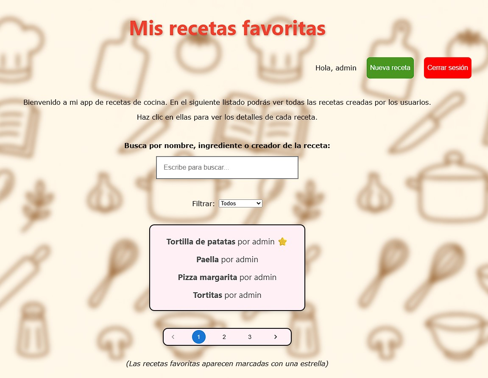
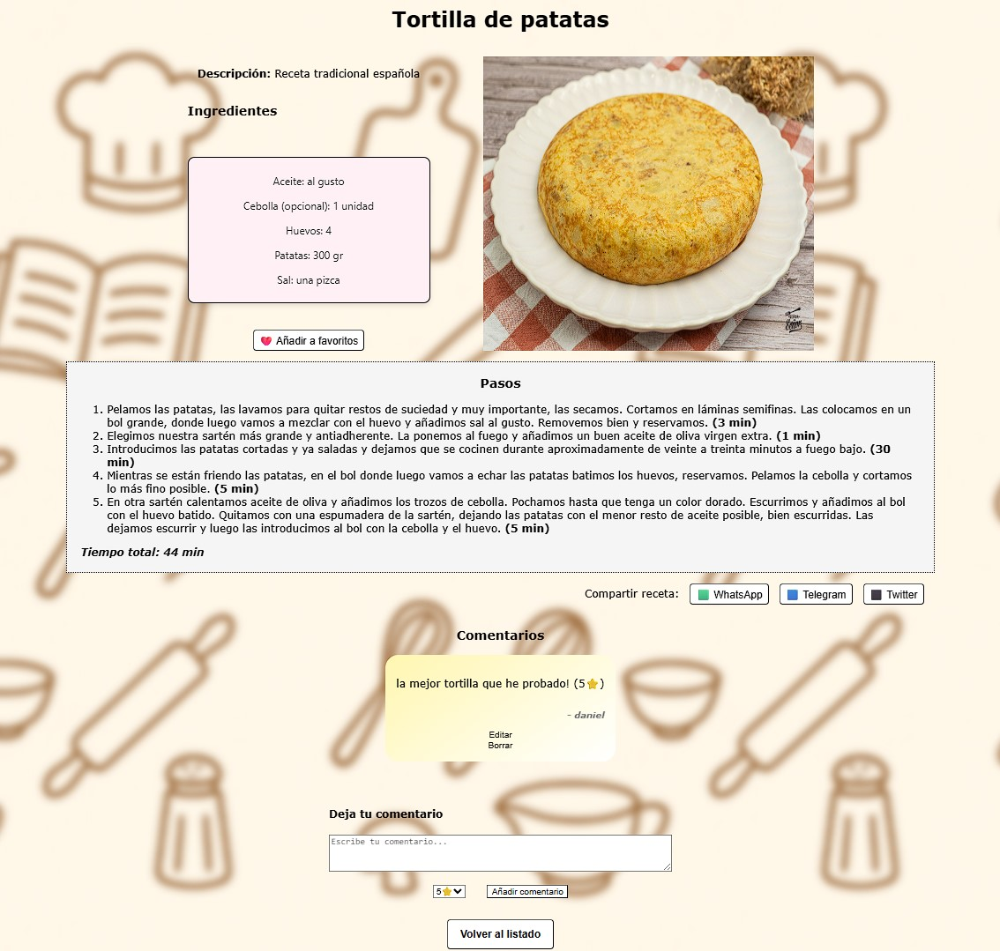

# Proyecto FullStack para la gestión de recetas de cocina 🥤🥗🍔🍗🍟🥓

Aplicación web desarrollada con React + Flask para la gestión de recetas de cocina. El usuario debe autenticarse para poder acceder a la app. Si no tiene usuario creado, debe registrarse. Al acceder se redirige a la página principal donde se listan todas las recetas creadas por todos los usuarios.

<!-- Personal project developed by Daniel Godoy -->
<!-- https://github.com/DanielGodoyGalindo -->

## Instalación
git clone https://github.com/DanielGodoyGalindo/recetas_cocina.git
pip install -r backend/requirements.txt
npm install
python backend/app.py
npm start

## Herramientas y lenguajes utilizados:

    
    
    
    
    

### Imágenes

### React Hooks

> #### *useState*
> Utilizado para mantener una variable de estado dentro de cada componente, como por ejemplo para obtener la receta a la que el usuario accede.

> #### *useEffect*
> Para mantener el comopnente sincronizado con elementos externos como por ejemplo formularios que obtienen datos cuando se edita una receta.

> #### *useContext*
> Se utiliza para la autenticación del usuario, guardando el token durente la sesión y para manejar el login y logout del usuario. De esta manera se evita tener que pasar como props el usuario y su token a traves de los componentes padres e hijos. Se crea un provider para poder usar el contexto en toda la app. También se incluye un contexto para enviar alertas al usuario indicandole información acerca de los eventos que se van ejecutando (receta creada, editada o eliminada con exito / error, etc...)

### Base de datos
Utiliza MySQL como motor de base de datos para guardar las recetas y los usuarios. Dentro de cada receta se guardan los ingredientes como un objeto JSON pero en texto plano, para luego construir objectos y acceder a sus propiedades.

### Autenticación
JWT (JSON Web Tokens) para manejar sesiones de usuario. Se generan tokens firmados y se protegen las rutas sensibles (create_recipe, update_recipe y delete_recipe). Los usuarios guardan su rol y pueden editar y borrar sus recetas. Los admin pueden borrar y editar las recetas de los demas usuarios y las suyas. Registro de usuario con hash de contraseña usando bcrypt. Login que devuelve token JWT y datos de usuario (username y role)

### Routing
Uso de Blueprints de Flask para el enrutamiento de la app. Cada ruta tiene un comportamiento definido con Python. Se utiliza JWT para asegurar las rutas.

### Buscador de recetas por nombre, ingrediente o creador de la receta
Busca en la BDD por medio del Backend el término escrito por el usuario y muestra el resultado en tiempo real, de esta manera la búsqueda es mucho más eficiente que si se realizase en el Frontend.

### Filtro de recetas
Se incluye un filtro para mostrar las recetas según la opción que el usuario haya seleccionado: mostrar todas, sólo favoritas o mostrar las no favoritas. El filtro se ejecuta después del input que el usuario haya tecleado (si es que lo ha hecho.)

### Comentarios en recetas
Los usuarios puede dejar un comentario y una valoración en cada una de las recetas. Un usuario no puede votarse a si mísmo y sólo puede dejar un comentario por receta. Cuando se visualiza una receta, aparecen todos los comentarios de los usuarios.

### Recetas favoritas
Cada usuario puede marcar sus recetas favoritas, de modo que cuando esté logueado se muestre ⭐ en las recetas que ha marcado como favoritas en el listado de todas las recetas. Dentro de los detalles de cada receta, el usuario puede añadir / quitar de sus favoritos, de modo que se muestre un botón u otro, dependiendo del estado favorito de la receta. El componente se renderiza cada vez que el usuario añade / elimina de sus favoritos.

### Compartir receta
Dentro de cada receta se incluyen botones para compartir la receta en WhatsApp, Telegram y X. El usuario puede enviar así la receta autenticandose en cada una de estas plataformas.

### Imagen de receta
El usuario puede añadir su propia imagen a cada receta, guardandose el fichero en el servidor, de modo que no se utiliza una url para mostrar las imagenes sino que se accede a las imagenes por medio de rutas relativas.

### Paginación
Se ha incluido un componente para la paginación de las recetas en la página principal, de manera que se pueden elegir el número de recetas a mostrar por página. Se ha integrado para que se lance después del filtro del input del usuario y después del select, para que todo funcione conjuntamente. Link al componente utilizado:
https://mui.com/material-ui/react-pagination/

### ToDo
* Que el usuario indique unos ingredientes y la app le indique que recetas podría hacer con esos ingredientes (in progress)
* Agregar access_token y refresh_token para comtrolar el login de los usuarios.